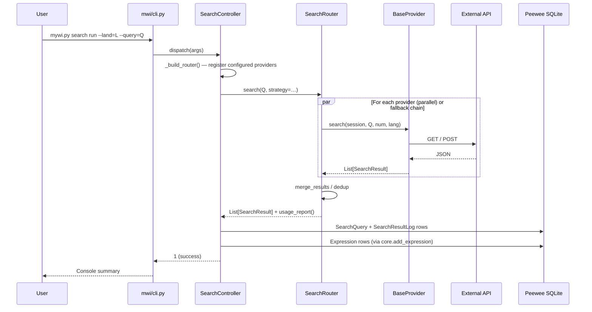

# Multi-API Search Router — Developer Guide

Architecture, extension recipe, and call-flow diagrams for the
`mwi/search/` package.

User-facing documentation: [`docs/search_router.md`](search_router.md).

## 1. Package layout

```text
mwi/search/
├── __init__.py            # Public surface (SearchRouter, dataclasses)
├── models.py              # SearchResult, ProviderStatus, ProviderUsage
├── utils.py               # canonicalize_url, merge_results
├── router.py              # SearchRouter — strategies + telemetry
└── providers/
    ├── __init__.py        # Re-exports BaseProvider only (lazy imports)
    ├── base.py            # BaseProvider ABC
    ├── searxng.py
    ├── brave.py
    ├── serper.py
    ├── serpapi.py
    └── tavily.py
```

`mwi/search/` is **independent** from `mwi/serpapi_router.py` (the
single-engine SerpAPI helper used by `land urlist`). They do not import
each other.

## 2. Sequence diagram (`search run`)



## 3. Adding a new provider

Recipe in 4 steps:

### 3.1 Create the adapter

Create `mwi/search/providers/<name>.py` and subclass `BaseProvider`:

```python
import os, asyncio
import aiohttp
from mwi.search.models import ProviderStatus, SearchResult
from mwi.search.providers.base import BaseProvider


class MyProvider(BaseProvider):
    name = "myprovider"
    monthly_quota = 5000  # informative
    timeout = 30.0

    def __init__(self, api_key=None):
        super().__init__()
        self.api_key = api_key or os.getenv("MYPROVIDER_API_KEY")

    def is_configured(self) -> bool:
        if not self.api_key:
            self.last_status = ProviderStatus.NOT_CONFIGURED
            return False
        return True

    async def search(self, session, query, num=20, language="fr"):
        if not self.is_configured():
            return []
        if not query.strip():
            self._mark_error(ProviderStatus.ERROR, "empty query")
            return []
        await self._wait_politeness_window()

        try:
            async with session.get(
                "https://api.myprovider.example/search",
                params={"q": query, "n": num, "lang": language},
                headers={"X-API-KEY": self.api_key},
                timeout=aiohttp.ClientTimeout(total=self.timeout),
            ) as resp:
                if resp.status in (402, 429):
                    self._mark_error(ProviderStatus.QUOTA_EXCEEDED,
                                     f"HTTP {resp.status}")
                    return []
                if resp.status != 200:
                    self._mark_error(ProviderStatus.ERROR, f"HTTP {resp.status}")
                    return []
                payload = await resp.json(content_type=None)
        except (asyncio.TimeoutError, aiohttp.ClientError) as exc:
            self._mark_error(ProviderStatus.ERROR, str(exc))
            return []

        self._mark_call()
        self.last_status = ProviderStatus.OK
        return [
            SearchResult(
                url=item["link"],
                title=item.get("title"),
                snippet=item.get("snippet"),
                rank=idx,
                providers=self.name,
                raw=item,
            )
            for idx, item in enumerate(payload.get("results", [])[:num], start=1)
        ]
```

### 3.2 Register in the controller

Edit `mwi/controller.py` — `SearchController._build_router` and
`SearchController._all_providers` — to include your new class. Do **not**
import it at module top: keep the lazy import pattern so unrelated MWI
commands stay light.

```python
from .search.providers.myprovider import MyProvider
# ... add to the tuple in _build_router() and _all_providers()
```

### 3.3 Document settings

Add to `settings-example.py` and `.env.example`:

```python
MYPROVIDER_API_KEY = os.getenv("MYPROVIDER_API_KEY")
```

### 3.4 Tests

Create `tests/test_NN_search_provider_myprovider.py` mirroring the five
canonical tests every provider must pass:

- `test_search_success`
- `test_missing_key`
- `test_quota_exceeded`
- `test_network_error`
- `test_empty_response`

Use `aioresponses` to mock HTTP — never hit real APIs in CI.

## 4. The `BaseProvider` contract — invariants

| Invariant | Reason |
|-----------|--------|
| `search()` never raises | The router uses `gather(return_exceptions=True)` but counts exceptions as errors — adapters should self-handle. |
| `last_status` reflects the last call outcome | Used by `usage_report()`. |
| `is_configured() == False` ⇒ `search()` returns `[]` immediately | Avoids surprise outbound traffic. |
| `monthly_quota` is informative only | The router does not enforce it. |
| `min_delay_between_calls` honoured per-instance | Avoids tripping rate-limits on the free tiers. |

## 5. Strategy selection rationale

- **fallback** is the default because it preserves quotas — most lab
  budgets only afford SerpAPI's 100 req/month.
- **parallel** is the methodological gold standard (triangulation —
  Rogers, *Doing Digital Methods*, 2019) but uses N× the quota for one
  query.

When in doubt, document the choice in the paper (the strategy is
stored in `searchquery.strategy`).

## 6. URL canonicalisation policy

The router applies a **conservative** canonicalisation in
`mwi.search.utils.canonicalize_url`:

- lowercase scheme + netloc
- drop fragment
- drop trailing slash on non-root paths
- preserve query string verbatim

The aggressive transforms (UTM stripping, query sorting, etc.) live in
`mwi.url_normalizer` and are applied **at Expression insertion time**
inside `core.add_expression`. This keeps the dedup map of the router
neutral and the database canonicalisation centralised.

## 7. Database schema

Two tables created by `migrations/010_add_search_tables.py`.

> **Note on table names** — the tables are named `searchquery` and
> `searchresultlog` (single-word, no underscore). This is the Peewee ORM
> default (`ClassName.lower()`) since neither model overrides
> `Meta.table_name`. The early specification draft used the snake_case
> names `search_query` / `search_result_log`; the implementation
> consciously kept the Peewee default to avoid a custom `Meta` block.
> When writing audit SQL by hand, use `searchquery` / `searchresultlog`
> (the names above are authoritative — `sqlite3 data/mwi.db ".tables"`
> confirms).

```sql
CREATE TABLE searchquery (
    id INTEGER PRIMARY KEY,
    land_id INTEGER NOT NULL,
    query TEXT,
    strategy VARCHAR(20),
    language VARCHAR(5),
    num_requested INTEGER,
    num_collected INTEGER,
    created_at DATETIME,
    completed_at DATETIME,
    usage_report TEXT,
    FOREIGN KEY(land_id) REFERENCES land(id) ON DELETE CASCADE
);

CREATE TABLE searchresultlog (
    id INTEGER PRIMARY KEY,
    search_query_id INTEGER NOT NULL,
    url TEXT,
    title TEXT,
    snippet TEXT,
    providers VARCHAR(200),
    rank_min INTEGER,
    expression_id INTEGER,
    created_at DATETIME,
    UNIQUE (search_query_id, url),
    FOREIGN KEY(search_query_id) REFERENCES searchquery(id) ON DELETE CASCADE,
    FOREIGN KEY(expression_id) REFERENCES expression(id) ON DELETE SET NULL
);
```

## 8. Telemetry — `usage_report`

Stored as JSON in `searchquery.usage_report`. Schema:

```json
{
  "searxng": {"name": "searxng", "calls": 1, "errors": 0,
              "status": "ok", "monthly_quota": null},
  "brave":   {"name": "brave",   "calls": 1, "errors": 1,
              "status": "quota_exceeded", "monthly_quota": 1000}
}
```

The keys (`status` values) are part of the public API — see
`mwi.search.models.ProviderStatus`.
